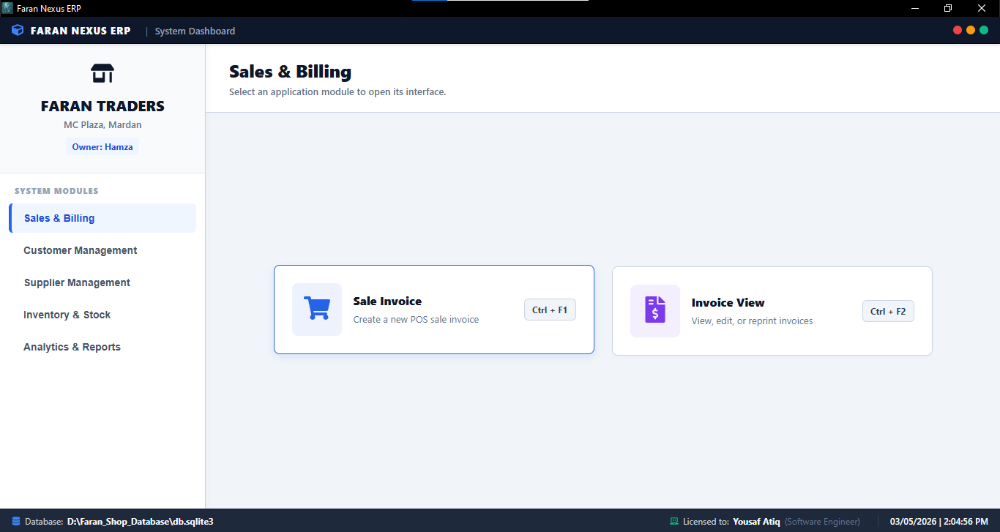
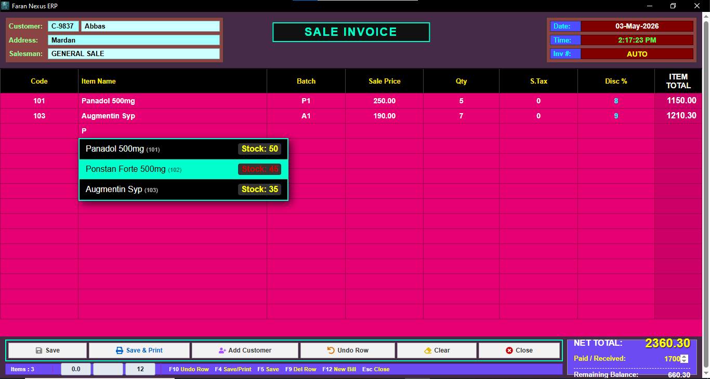
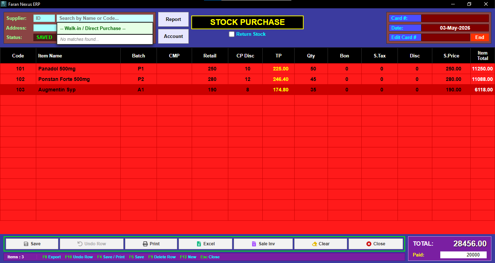
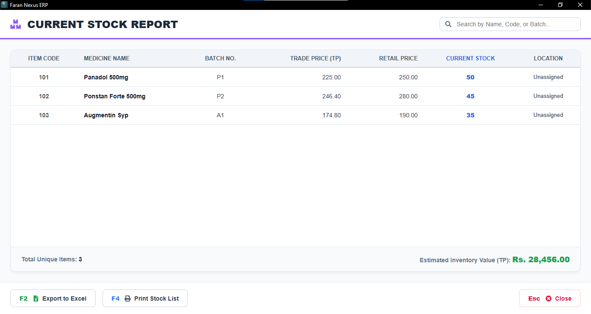
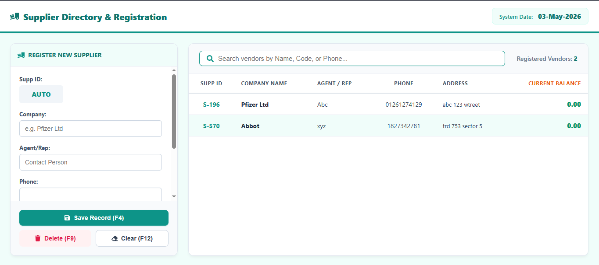
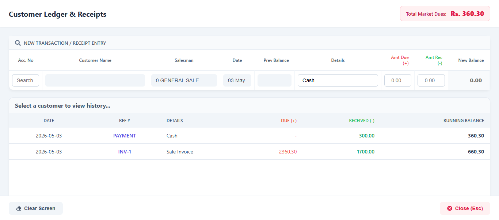
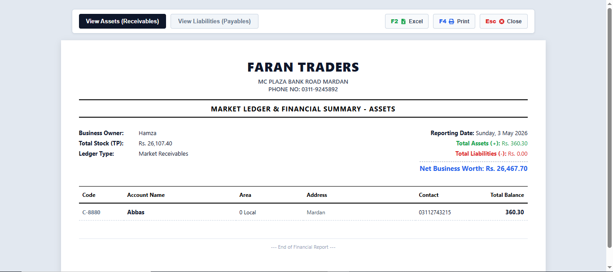

# 🏥 Faran Nexus ERP | Enterprise Pharmacy Management System

 

A full-stack, enterprise-grade Enterprise Resource Planning (ERP) application engineered specifically for retail pharmacies and medical stores. This project digitizes complex daily business operations, replacing error-prone manual ledger-keeping with a secure, automated, and entirely offline digital platform.

 

## 🚀 Architectural Overview & Deployment Strategy

This project solves a critical real-world constraint for local retail environments: **unreliable internet infrastructure.** 

While built using a modern decoupled web architecture (React + Django), it is uniquely deployed as a **native, offline Windows desktop application**. The application bundles a local WSGI web server and an SQLite relational database into a standalone executable using `PyInstaller`, served through a native Windows Webview wrapper.

### 🛠️ Technology Stack
* **Frontend:** React.js, Tailwind CSS, Vite (Optimized for lightning-fast DOM updates during heavy data entry).
* **Backend API:** Django, Django REST Framework (Python).
* **Database:** SQLite (Local RDBMS with complex relational mapping).
* **Desktop Wrapper:** PyInstaller & Python Webview.
* **Installer Compilation:** Inno Setup Compiler.

---

## ✨ Comprehensive System Features

### 🛒 1. Advanced Point of Sale (POS) & Billing
Engineered for high-speed retail environments where checkout speed is critical.
* **Keyboard-First Navigation:** Integrated shortcuts (F4, F12, Esc) to allow cashiers to operate entirely without a mouse.
* **Dynamic Calculations:** Real-time calculation of Net Totals, Sales Tax, and granular percentage-based Discounts.
* **Live Profit Tracking:** Instantly calculates the profit margin per invoice based on the differential between Trade Price (TP) and Retail Price.
* **Automated Stock Sync:** Instantly deducts purchased items from the master inventory upon invoice generation.
* **Invoice Management:** Dedicated `Invoice View` module for veiwing, auditing, or reprinting past transactions.

### 📥 2. Supply Chain & Stock Purchases
A robust ingestion engine for handling new inventory and complex vendor math.
* **Item-Level Math:** Handles complex pharmaceutical billing including Bonus Quantities (free items), Trade Price (TP) vs. Retail Price calculations, and Cash/Percentage Discounts.
* **Relational Updating:** Saving a purchase invoice dynamically updates the master inventory levels *and* posts the financial liability directly to the specific Supplier's Ledger.

### 📦 3. Live Inventory & Master Stock Management
A centralized database ensuring total visibility over pharmaceutical assets.
* **Batch Tracking:** Organizes stock by specific pharmaceutical batch numbers for accurate shelf-life monitoring.
* **Financial Valuations:** Provides instant, real-time calculation of total Estimated Inventory Value based on current Trade Prices.
* **Export Capabilities:** One-click export of the entire inventory database to Excel (F2) or direct-to-printer formatting (F4).

### 📒 4. Automated Financial Ledgers
Completely replaces physical account books with double-entry style tracking.
* **Supplier Directory & Ledgers:** Register vendors, log purchase invoices as liabilities, and track current running balances.
* **Customer Ledgers:** Automatically records amounts due from POS invoices, logs manual receipt payments, and calculates running balances with timestamped, transaction-level reference tracking.

### 📈 5. Financial Analytics & Asset Reporting
High-level reporting tools for business owners to assess company health.
* **Market Receivables & Payables:** Summarizes total debts owed by customers and total liabilities owed to suppliers.
* **Net Worth Calculation:** Dynamically calculates the Net Business Worth by combining Total Stock Value + Receivables - Liabilities.
* **Print-Ready Formatting:** Clean, professional report generation for daily cashbook auditing.

---

## 💻 Try It Out (For End Users)

You do not need to install Python, Node.js, or any web servers to use this application. It has been fully packaged into a standard, self-contained Windows installer.

1. Navigate to the `Faran_Nexus_Setup` folder in this repository.
2. Download the `Faran_Nexus_Setup.exe` file.
3. Run the installer and launch the application from your desktop shortcut.
*(Note: Because this is an offline architecture, all data generated during use is stored locally and securely on your machine).*

---

## 🛠️ Development & Contributing

If you wish to fork this project, view the source code, or contribute, follow these steps to run the application in a local development environment.

### Prerequisites
* Python 3.10+
* Node.js v18+
* Git

### Backend Setup
1. Clone the repository: `git clone (https://github.com/Usaf007/enterprise-pharmacy-erp.git)`
2. Create a virtual environment: `python -m venv erp_env`
3. Activate the environment: 
   * Windows: `erp_env\Scripts\activate`
   * Mac/Linux: `source erp_env/bin/activate`
4. Install requirements: `pip install -r requirements.txt` *(Ensure Django and DRF are installed)*
5. Run database migrations: `python manage.py migrate`
6. Start the local API server: `python manage.py runserver`

### Frontend Setup
1. Open a new terminal and navigate to the React folder: `cd desktop-app`
2. Install dependencies: `npm install`
3. Start the Vite development server: `npm run dev`

---

## 📄 License

This project is licensed under the MIT License - see the [LICENSE](LICENSE) file for details.

---

  <b>Architected and developed by Yousaf Atiq (Data Scientist| AI & ML Engineer)</b> 
  <i>Built as part of the 6th Semester Software Engineering curriculum.</i>  
  Made with ❤️ and ☕ in Mardan.

